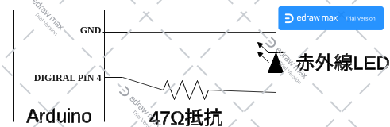

# Arduino Iris Circulator Controlとは
アイリスオーヤマ製のサーキュレーターをArduinoから操作するためのサンプルです。  
  
_ご利用はご自身の責任で。_

### 対象のサーキュレーター 
モデル名: PCF-SDC15T  
製造: アイリスオーヤマ  
販売サイト: https://www.irisplaza.co.jp/index.php?KB=SHOSAI&SID=H274315F  

### 実装に必要なもの
* Arduino  
* 赤外線LED (100 mA)  
* ジャンパワイヤなど   
* 抵抗(47Ω)  
  
_もう少し詳細にコントロールしたい場合は、ボタンスイッチなどの購入を考えてみてください。_

# 配線

電子工作用の赤外線LEDは直進性が高く、飛距離があまりないものがあるため、  
複数個を取り付けたり、より強いものに交換することで性能がよくできます。

# ソースコード
サンプルコードは２秒毎に各メッセージを赤外線送信します。  
必要に応じて改変してご利用ください。  
赤外線LEDのデフォルトピンは４に設定されています。
  
[ソースコードの場所] [PCF-SDC15T/PCF-SDC15T.ino](PCF-SDC15T/PCF-SDC15T.ino)

## 補足
### 各コマンド表
|コマンド名|NEC 32bit|
|:-----------|------------:|
|電源|0x017B00FF|
|切タイマー（2h/4h/8h）|0x017B30CF|
|首振り：左右（60/90/180）|0x017B50AF|
|首振り：上下|0x017B708F|
|弱|0x017B28D7|
|強|0x017B6897|
|送風モード：衣類乾燥|0x017B8877|
|送風モード：連続|0x017B906F|
|送風モード：リズム|0x017BB04F|

切タイマーと首振り：左右は複数回送信することで時間や角度が切り替わります。

